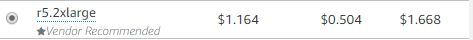

**
강재구
**
# 1. KNIME Server

## 1.1. KNIME Server

|종류|용도|
|:-:|:-:|
|Server Large|Enterprise|
|Server Medium|Smaller orgs|
|Server Small|Small team / Getting Started|

### 1.1.1 KNIME Server 특징

1. Tomcat Server 기반
2. KNIME USER에게 공유 원격 저장소를 제공
3. KNIME WebPortal 혹은 RESTful로 실행 가능
4. KNIME Server Component

    4.1. Server Side Component

        - KNIME Analytics Platform를 통해 Work Flow execute
        - Tomcat Server 에 설치되어짐(Tomcat User와 동일User로 설치하는 것을 권장)
    
    4.2. Client Interface

        - Server Repository와 상호작용
        - KNIME Analytics Platform 및 KNIME WebPortal과 통합
                           or 
        - REST API를 통해 액세스 가능

### 1.1.2 Prerequisites     

||OS|Resource(Recommend)|JDK|Repository|
|:-:|:-:|:-:|:-:|:-:|
|Server|Windows Server 2016, 2019 Ubuntu 16.04 LTS. 18.04 LTS RHEL/CentOS 6.7+, 7.x|64 bits  16GB RAM 8 CPU|JDK 8|250GB disk|
|Client|Windows Linux macOS|.|.|.|

## 1.2. Server에서 제공하는 서비스/가격

- 약 1800만원/년

### 1.2.1. End User Side에서 서비스 제공받는 방법

- KNIME Analytics Platform 및 KNIME WebPortal과 통합
- REST API

---

# 2. KNIME Analytics Platform 설치

**[링크](https://www.knime.com/downloads)**

# 3. 참고링크
[KNIME Server Installation Guide](https://docs.knime.com/2018-12/server_installation_guide/index.html)

[KNIME Server Administration Guide](https://docs.knime.com/2018-12/server_admin_guid/index.html)

[KNIME Server](https://www.knime.com/knime-server)

# 4. 기타

## 방법 1. KNIME Server 사용
   * KNIME Analytics Platform -> KNIME Server -> Client 
## 방법 2. Event Listen
   * KNIME Analytics Platform -> *.csv File -> Client