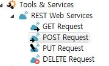

# **2019-08-29**

## **1. 자체 개발한 RESTful API** 

 * 현재까지는 찾지 못했고, 계속 찾아보고 있는 중입니다.

   별개로 KNIME내부에 REST Web Services 라는 Tool을 통해 타 네트워크와의 
   
   어느정도의 교류는 가능합니다. 
   
   

## **2. Logstash에서 Oracle JDBC Input Plugin 설정**

 * 로컬PC(VM)에 ELK Stack이 깔려있어서 로컬로 진행했습니다.
   
   판토스 OracleDB를 연결했고 첨부파일 내용을 query했습니다. 

